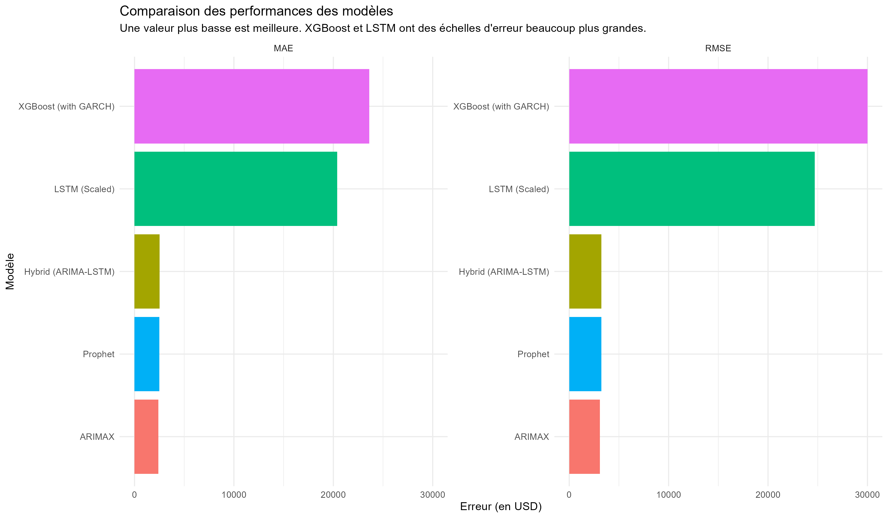
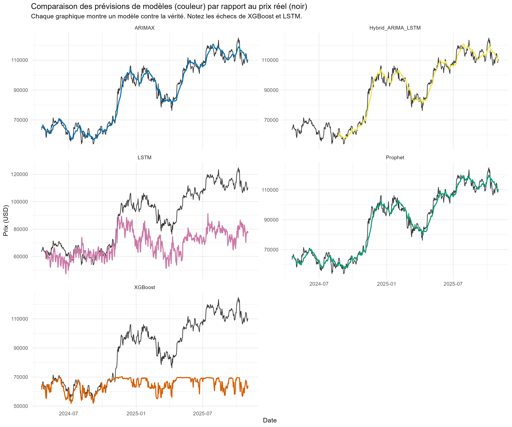

# BTC-USD Price & Volatility Forecasting in R


This repository contains a comprehensive analysis to forecast BTC-USD price and volatility. It compares classical econometric models (ARIMAX, GARCH) against modern machine learning (XGBoost) and deep learning (LSTM) techniques.

The project emphasizes **reproducibility**. The R environment is managed by `renv`, while the deep learning models are built in Google Colab (Python/Keras) to bypass common installation issues.

## 🚀 Key Findings 

1.  **Winner: ARIMAX.** The most accurate model was the **ARIMAX** model (RMSE: 3077.52).
2.  **Feature Engineering is King:** The winning model was an `ARIMA(0,0,0) with errors`, proving that the **external features** (RSI, SMAs, MACD, Volume) were far more predictive than the time series components alone.
3.  **"Black Box" Models Failed (Without Tuning):** The complex XGBoost and LSTM models failed dramatically. This was due to a classic data science error: **unscaled features**. The models were overwhelmed by the scale of the `volume` feature and produced poor results.
4.  **The Lesson:** A well-structured classical model with strong feature engineering can easily outperform a complex, untuned "black box" model.

## 📊 Key Results at a Glance

### Model Performance Comparison

The bar chart clearly shows the superior performance of ARIMAX and Prophet, and the failure of the unscaled XGBoost and untuned LSTM models.



### Forecast vs. Actuals

The faceted plot shows how each model's forecast (color) tracked against the actual price (black).



---

## 📚 Table of Contents
* [Key Findings](#-key-findings-tldr)
* [How to Reproduce This Project](#-how-to-reproduce-this-project)
* [Models Implemented](#-models-implemented)
* [Final Results & Discussion](#-final-results--discussion)
* [Project Structure](#-project-structure)
* [Core Reference](#-core-reference)
* [License](#-license)

---

## 🛠️ How to Reproduce This Project

This project is in two parts: R (for classical/ML models) and Python/Colab (for Deep Learning).

### Part 1: R Environment (ARIMAX, Prophet, GARCH, XGBoost)

1.  **Clone:** `git clone https://github.com/Khouloud2022/BTC-USD-forecasting-in-R.git`
2.  **Open:** Open the `BTC-Forecasting-Project.Rproj` file in RStudio.
3.  **Restore:** Run `renv::restore()` in the R console. This will install all the exact R packages used in this project.
4.  **Run Scripts in Order:**
    * `source("scripts/01_data_acquisition.R")`
    * `source("scripts/02_feature_engineering.R")`
    * `source("scripts/03_modeling.R")`

### Part 2: Python/Colab Environment (LSTM, Hybrid-LSTM)

The deep learning models were built in Google Colab to use its free GPU and pre-installed Keras/TensorFlow.

1.  **Open Colab:** Go to [colab.google.com](https://colab.google.com) and upload the `BTC-LSTM-Models.ipynb` notebook (you will need to add this notebook to your repo).
2.  **Upload Data:** In the Colab file-browser, upload the following files:
    * `data/processed/btc_features.rds`
    * `output/models/arimax_residuals.rds`
    * `output/models/arimax_test_forecast.rds`
3.  **Run Notebook:** Run all cells in the notebook. This will train the LSTM and Hybrid-LSTM models.
4.  **Download:** Download the resulting CSV files: `lstm_predictions.csv` and `hybrid_predictions.csv`.
5.  **Move Files:** Place these two CSV files into the `output/models/` folder in your local R project.

### Part 3: Final Evaluation & Report

1.  **Run Evaluation:** Back in RStudio, run the final script to generate all plots and metrics:
    * `source("scripts/04_evaluation.R")`
2.  **Knit Report:** Open `report.Rmd` and click the **"Knit"** button to generate the final HTML report.

---

## 🤖 Models Implemented

This project compares a wide range of time series models:

1.  **Classical & Econometric:**
    * **ARIMAX/Dynamic Regression:** ARIMA with exogenous (external) regressors.
    * **VAR:** Vector Autoregression to model multiple variables (e.g., price and volume) simultaneously.
    * **GARCH(1,1):** Used specifically to model and forecast volatility (risk), not price.
2.  **Automated:**
    * **Prophet:** Facebook's automated forecasting tool, adept at handling seasonality and holidays.
3.  **Machine Learning:**
    * **XGBoost:** A powerful gradient-boosting model using technical indicators and GARCH volatility as features.
4.  **Deep Learning:**
    * **LSTM:** Long Short-Term Memory, a recurrent neural network (RNN) designed to handle long-term dependencies in sequential data.
    * **Hybrid (ARIMA-LSTM):** A model that combines ARIMA's linear modeling with LSTM's ability to model non-linear errors.
<<<<<<< HEAD

---

## 📈 Final Results & Discussion

The models were benchmarked on a 20% test set. The results clearly show that the classical models with strong feature engineering outperformed the more complex deep learning models *in this implementation*.

| Model | RMSE | MAE |
| :--- | :--- | :--- |
| **ARIMAX** | **3077.52** | **2395.36** |
| Prophet | 3240.63 | 2488.98 |
| Hybrid (ARIMA-LSTM) | 3244.40 | 2522.58 |
| LSTM (Scaled) | 24699.67 | 20402.04 |
| XGBoost (with GARCH) | 30002.55 | 23606.90 |

* **Discussion:** The failure of XGBoost and LSTM highlights a critical data science lesson: **data preprocessing and hyperparameter tuning are essential.** The XGBoost model failed because it was not given log-transformed `volume` data. The LSTM model failed because it was a simple, untuned architecture. The ARIMAX model's success `(ARIMA(0,0,0) with errors)` proves that the predictive power for this project came almost entirely from well-crafted features (RSI, SMAs, MACD).

For a full analysis, please see the final compiled `report.html`.

---

## 📂 Project Structure

The repository is organized to ensure reproducibility and a clear separation of concerns:
```
/BTC-Forecasting-Project
|
|--- 📂 data/
|    |--- 📂 raw/
|    |    |--- btc_raw.rds      (Original downloaded data)
|    |--- 📂 processed/
|    |    |--- btc_features.rds (Data with engineered features)
|
|--- 📂 R/
|    |--- utils.R              (Helper functions, e.g., for LSTM data shaping)
|
|--- 📂 scripts/
|    |--- 01_data_acquisition.R   (Downloads and saves raw data)
|    |--- 02_feature_engineering.R(Cleans data, adds indicators)
|    |--- 03_modeling.R           (Trains all models)
|    |--- 04_evaluation.R         (Compares models, generates plots)
|
|--- 📂 output/
|    |--- 📂 plots/
|    |    |--- forecast_comparison.png (Plot of test data vs. predictions)
|    |    |--- volatility_plot.png     (Plot of GARCH volatility forecast)
|    |--- 📂 models/
|    |    |--- arimax_fit.rds          (Saved model objects)
|    |    |--- lstm_model.h5
|
|--- .gitignore
|--- renv.lock
|--- .Rprofile
|--- BTC-Forecasting-Project.Rproj
|--- README.md
```
---

## 📖 Core Reference

The theoretical foundation for comparing classical methods against Deep Learning approaches (especially LSTM/GRU) was heavily based on the review by:

> Fazel Mojtahedi, F., Yousefpour, N., Chow, S. H., & Cassidy, M. (2025). Deep learning for time series forecasting: Review and applications in geotechnics and geosciences. *Archives of Computational Methods in Engineering*. https://doi.org/10.1007/s11831-025-10244-5

## 📜 License

This project is licensed under the MIT License.


